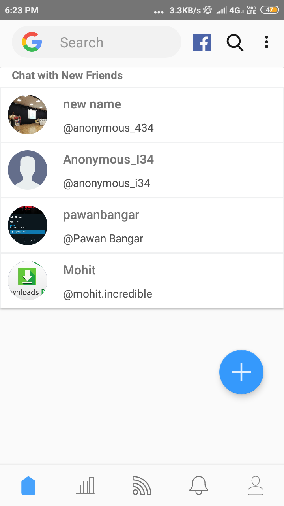
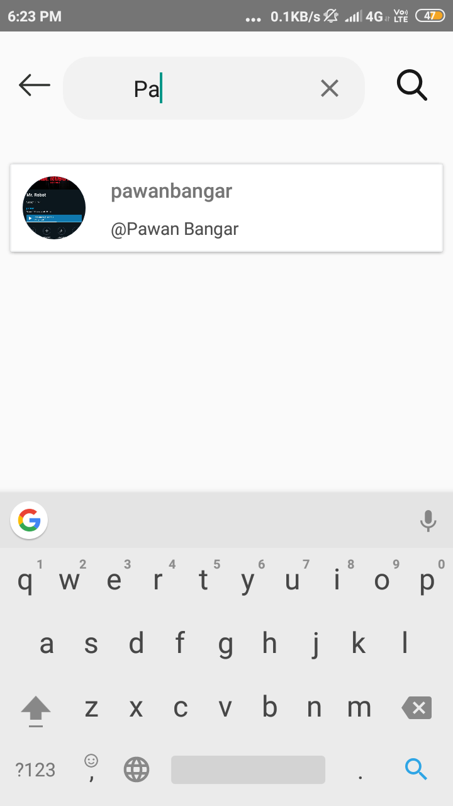
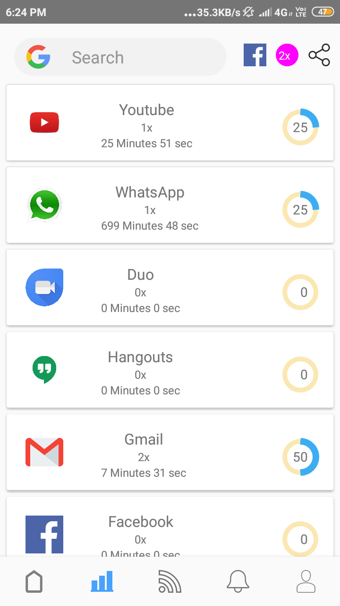
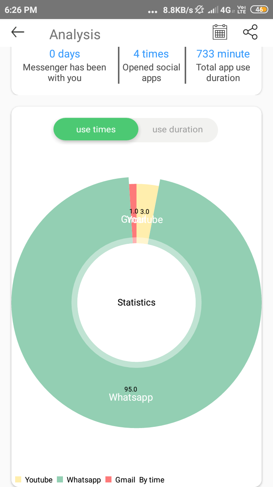
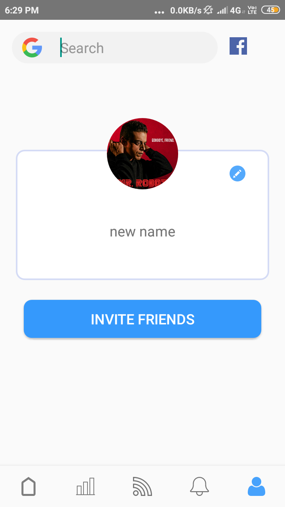

# Messenger
 All in One Messeging App where you can see trending news, app usage, Social Media, App Usage analysis

## 1. Messaging Screen

## 2. Messaging History App

## 3. App Usages
 

## 4. Social Media

## 5. News Details Using newsApi.org

## 6. Horizontal news scrolling

## 7. App Usage Analysis
 

## 8. Profile Screen
 

## 9. Empty Message screen

